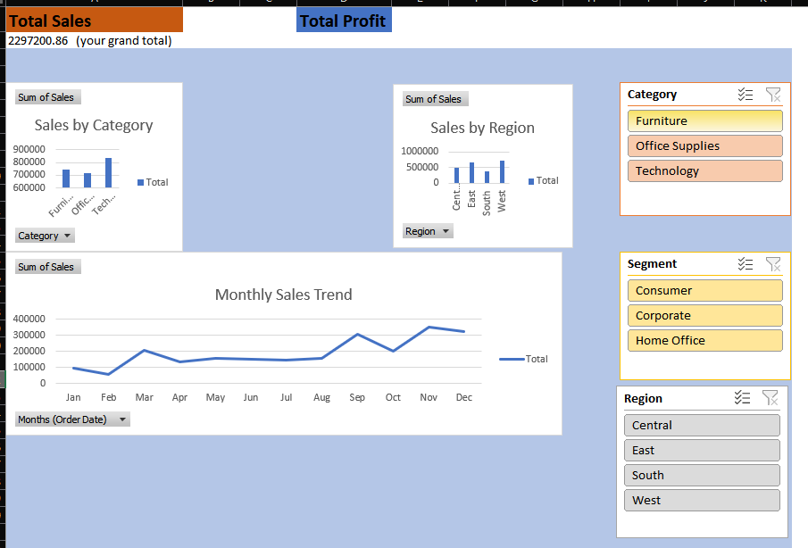

# 👩‍💻 K Rajeshwari – Data Analyst Portfolio

---

## 📖 About Me
Aspiring Data Analyst skilled in data cleaning, analysis, visualization, and storytelling.

---

## 🚀 Projects

### 🔹 Task 1: Data Cleaning
- Cleaned dataset using Python & Pandas  
👉 [View Project](./Task1)

---

### 🔹 Task 2: Exploratory Data Analysis
- Performed data analysis and extracted insights  
👉 [View Project](./Task2)

---

### 🔹 Task 3: Dashboard Creation
- Built interactive dashboard using Excel  
👉 [View Project](./Task3)

---

### 🔹 Task 4: Data Storytelling & Hypothesis Testing
- Converted insights into business story  
👉 [View Project](./Task4)

---

## 🛠️ Skills
- Python  
- Pandas  
- Excel  
- Data Visualization  
- Dashboarding  

---

## 📊 Dashboard Preview

---

## 🔗 Connect With Me
- LinkedIn: (https://www.linkedin.com/in/rajeshwari-kommula-20355a350/)

---

## 🎯 Outcome
This portfolio showcases end-to-end data analytics workflow from raw data to insights.

---
